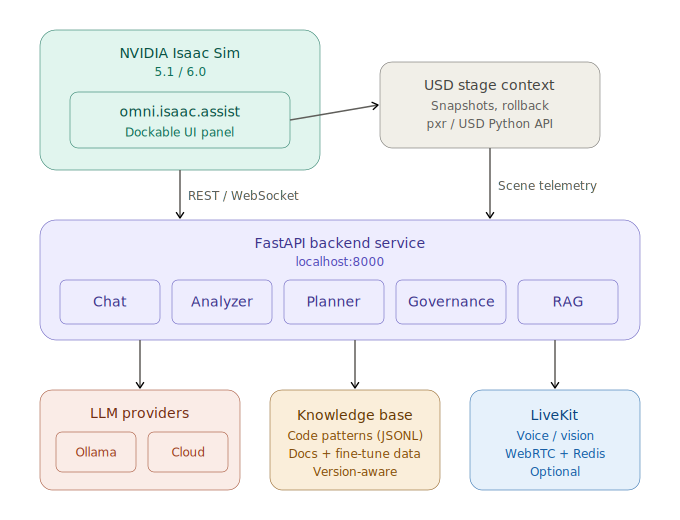
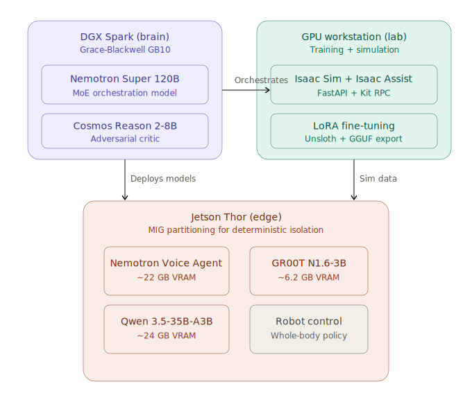
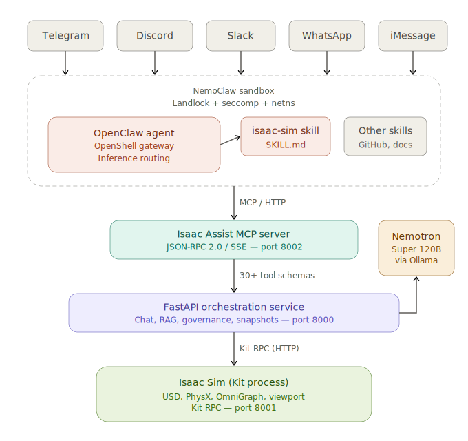

# Isaac Assist — Omniverse Extension & Background Service

> An agentic AI assistant for NVIDIA Isaac Sim that provides LLM-powered scene diagnostics, patch planning, and governance — surfaced through a dockable Omniverse UI panel backed by a local FastAPI service.

---

## Architecture







---

## Table of Contents

1. [Prerequisites](#1-prerequisites)
2. [Repository Layout](#2-repository-layout)
3. [Background Service Setup](#3-background-service-setup)
4. [LiveKit Voice Infrastructure (Optional)](#4-livekit-voice-infrastructure-optional)
5. [Running the Omniverse Extension](#5-running-the-omniverse-extension)
6. [Verify Everything Is Connected](#6-verify-everything-is-connected)
7. [Configuration Reference](#7-configuration-reference)
8. [Feature Modules](#8-feature-modules)
9. [Contributing Data & Helping Train the Model](#9-contributing-data--helping-train-the-model)

---

## 1. Prerequisites

| Requirement | Version |
|---|---|
| NVIDIA Isaac Sim | 5.1 or 6.0 |
| Python (system host) | 3.10+ |
| Docker + Docker Compose | Latest |
| Ollama *(local LLM mode)* | Latest |
| Git | Any |

> **GPU Note:** Isaac Sim requires an NVIDIA RTX GPU. Ensure your drivers and CUDA toolkit are up to date before proceeding.

---

## 2. Repository Layout

```
Omniverse_Nemotron_Ext/
├── exts/
│   ├── isaac_5.1/          # Omniverse Extension (Isaac Sim 5.1)
│   └── isaac_6.0/          # Omniverse Extension (Isaac Sim 6.0)
├── service/
│   └── isaac_assist_service/   # FastAPI backend service
│       ├── main.py             # App entry point
│       ├── .env.example        # Configuration template
│       └── ...                 # Feature modules (chat, analysis, planner, etc.)
├── infra/
│   └── livekit/            # Self-hosted LiveKit voice stack (Docker Compose)
├── scripts/                # Utility scripts (doc scraping, data curation)
├── launch_isaac.sh         # Recommended Isaac Sim launcher
└── requirements.txt        # Python backend dependencies
```

---

## 3. Background Service Setup

The FastAPI service must be running **before** you launch Isaac Sim. The extension UI communicates with it over `localhost:8000`.

### 3.1 Install dependencies

```bash
cd /path/to/Omniverse_Nemotron_Ext
pip install -r requirements.txt
```

### 3.2 Configure the environment

```bash
cp service/isaac_assist_service/.env.example service/isaac_assist_service/.env
# Open .env and set your preferred LLM mode and API keys
```

#### Key settings in `.env`

| Variable | Default | Description |
|---|---|---|
| `LLM_MODE` | `local` | `local` (Ollama) or `cloud` (Gemini) |
| `LOCAL_MODEL_NAME` | `cosmos-reason-2:latest` | Model name as shown in `ollama list` |
| `CLOUD_MODEL_NAME` | `gemini-robotics-er-1.5` | Google GenAI model identifier |
| `API_KEY_GEMINI` | *(empty)* | Required when `LLM_MODE=cloud` |
| `LIVEKIT_URL` | `ws://localhost:7880` | LiveKit server URL |

#### Pull the local model (if using `LLM_MODE=local`)

```bash
ollama pull cosmos-reason-2:latest
```

### 3.3 Start the service

```bash
cd /path/to/Omniverse_Nemotron_Ext
uvicorn service.isaac_assist_service.main:app --host 0.0.0.0 --port 8000 --reload
```

The service starts at **`http://localhost:8000`**.  
Interactive API docs are available at **`http://localhost:8000/docs`**.

---

## 4. LiveKit Voice Infrastructure (Optional)

Skip this section if you do not need voice/audio features.

```bash
cd infra/livekit
docker compose up -d
```

This starts:
- **LiveKit server** on ports `7880` (WebSocket), `7881` (HTTP), `7882/udp` (WebRTC)
- **Redis** on port `6379` (required by LiveKit)

To stop:

```bash
docker compose down
```

---

## 5. Running the Omniverse Extension

### 5.1 Using the launch script (recommended)

The `launch_isaac.sh` script configures the correct ROS2 environment and registers the extension folder automatically.

```bash
# Launch Isaac Sim with an empty scene
./launch_isaac.sh

# Launch Isaac Sim and open a specific USD file
./launch_isaac.sh /path/to/scene.usd
```

To point at a custom Isaac Sim installation, set `ISAAC_SIM_PATH` in your `.env` file or export it before launching:

```bash
export ISAAC_SIM_PATH=/path/to/your/isaac-sim
./launch_isaac.sh
```

The script auto-detects architecture (`x86_64` or `aarch64`) and sets default paths accordingly:

| Architecture | Default Path |
|---|---|
| x86_64 | `~/isaac-sim/isaac-sim-standalone-5.1.0-linux-x86_64` |
| aarch64 (Jetson / DGX Spark) | `~/Documents/Github/isaacsim/_build/linux-aarch64/release` |

### 5.2 Manual extension loading (Isaac Sim Extension Manager)

If you prefer to load the extension manually inside Isaac Sim:

1. Open Isaac Sim.
2. Go to **Window → Extensions**.
3. Click the **⚙ gear icon** → **Add Extension Search Path**.
4. Add the path to the appropriate `exts/` folder:
   - Isaac Sim 5.1: `<repo_root>/exts/isaac_5.1`
   - Isaac Sim 6.0: `<repo_root>/exts/isaac_6.0`
5. Search for **`omni.isaac.assist`** and toggle it **ON**.

---

## 6. Verify Everything Is Connected

### Health-check the backend service

```bash
curl http://localhost:8000/health
# Expected: {"status":"ok","service":"isaac-assist-backend"}
```

### Check the Extension UI

Once Isaac Sim is open and the extension is enabled, the **Isaac Assist** panel should appear as a dockable window. If it does not:

- Confirm the service is running (`curl` above).
- Check the Isaac Sim console (**Window → Console**) for extension errors.
- Verify the extension search path is registered (Step 5.2).

---

## 7. Configuration Reference

Configuration is loaded in priority order (later files override earlier ones):

```
.env                  ← repo root defaults (git-ignored)
service/…/.env        ← service-level overrides (git-ignored)
.env.local            ← YOUR personal overrides — highest priority (git-ignored)
```

**Quick start:** Copy the example file and fill in your values:

```bash
cp .env.local.example .env.local
# Edit .env.local with your API keys and asset paths
```

See [`.env.local.example`](.env.local.example) for the full annotated template.

#### Key settings

| Variable | Example | Description |
|---|---|---|
| `LLM_MODE` | `anthropic` | `anthropic`, `openai`, `ollama`, or `gemini` |
| `CLOUD_MODEL_NAME` | `claude-opus-4-6` | Model name for cloud providers |
| `ANTHROPIC_API_KEY` | `sk-ant-xxx` | API key for your chosen provider |
| `ASSETS_ROOT_PATH` | `/home/user/assets` | Path to Isaac Sim USD assets (local or Nucleus) |
| `ASSETS_ROBOTS_SUBDIR` | `Collected_Robots` | Subdirectory containing robot USD files |
| `LIVEKIT_URL` | `ws://localhost:7880` | LiveKit server (optional, for voice/vision) |
| `CONTRIBUTE_DATA` | `false` | Log approved patches for fine-tuning |

#### Asset path examples

```bash
# Local filesystem (recommended — works offline)
ASSETS_ROOT_PATH=/home/user/Desktop/assets

# NVIDIA Omniverse Nucleus server
ASSETS_ROOT_PATH=omniverse://localhost/NVIDIA/Assets/Isaac/5.1

# NVIDIA S3 hosted (requires network access)
ASSETS_ROOT_PATH=https://omniverse-content-production.s3-us-west-2.amazonaws.com/Assets/Isaac/5.1
```

---

## 8. Feature Modules

The FastAPI service exposes the following REST API modules, all prefixed under `/api/v1/`:

| Endpoint Prefix | Module | Description |
|---|---|---|
| `/chat` | Chat Orchestration | Multi-turn LLM conversations with the stage context |
| `/fingerprint` | Environment Fingerprint | Hardware, Omniverse version & active extension telemetry |
| `/snapshots` | Snapshot Manager | USD stage serialization and rollback |
| `/retrieval` | Source Registry RAG | Omniverse doc scraping + vector retrieval |
| `/analysis` | Stage Analyzer | Scene constraint checks and validator packs |
| `/plans` | Patch Planner | Repair plan generation and execution engine |
| `/governance` | Approval Engine | Dry-run UI dialogs for user-governed USD edits |
| `/settings` | Configuration Options | Model switching, Ollama pull triggers, API keys |
| `/finetune` | Fine-tuning Builder | Knowledge Base → training data pipeline |

Full interactive documentation: **`http://localhost:8000/docs`**

---

## 9. Contributing Data & Helping Train the Model

Isaac Assist uses a **version-aware knowledge base** to ground the LLM in verified, working code patterns for each Isaac Sim release. Community contributions to this knowledge base directly improve the quality of generated code for everyone — and can ultimately feed into a fine-tuned model purpose-built for Isaac Sim development.

### 9.1 How the Knowledge Base Works

The knowledge base lives in `workspace/knowledge/` and consists of:

| File | Purpose |
|---|---|
| `code_patterns_5.1.0.jsonl` | Verified code snippets for Isaac Sim 5.1 |
| `code_patterns_6.0.0.jsonl` | Verified code snippets for Isaac Sim 6.0 *(coming soon)* |
| `knowledge_5.1.0.jsonl` | Indexed documentation chunks |

When a user asks the LLM to perform an action, the system automatically retrieves relevant patterns for the active Isaac Sim version and injects them into the prompt. This means the LLM sees **working, tested code** rather than hallucinating outdated Kit commands.

### 9.2 Contributing Code Patterns

Code patterns are stored as JSONL (one JSON object per line). Each entry has this format:

```json
{
  "title": "Short descriptive title",
  "keywords": ["keyword1", "keyword2", "keyword3"],
  "code": "import omni.usd\nfrom pxr import UsdGeom\n\n# ... working code ...",
  "note": "Brief note about gotchas or why this approach is preferred."
}
```

**To contribute a pattern:**

1. Fork this repository
2. Open the appropriate `workspace/knowledge/code_patterns_<version>.jsonl`
3. Add your entry as a new line at the end of the file
4. Test the code in the matching Isaac Sim version to confirm it works
5. Submit a PR with:
   - The JSONL entry
   - Which Isaac Sim version you tested on
   - A brief description of what the pattern does

**Good pattern contributions:**
- Working code for Isaac Sim APIs that are poorly documented
- Patterns that replace broken or deprecated Kit commands with direct USD/pxr API calls
- Robotics workflows (URDF import, joint drives, articulations)
- Sensor setup (cameras, lidar, IMU)
- OmniGraph node creation for ROS2 bridges
- Physics tuning (solver iterations, collision groups, deformable parameters)

> **Important:** All contributed patterns should use **direct pxr/USD Python APIs** rather than `omni.kit.commands.execute(...)` — Kit commands are unreliable across Isaac Sim versions.

### 9.3 Contributing Documentation

If you have Isaac Sim documentation, tutorials, or workflow notes, you can contribute them to the RAG index:

1. Add `.md` or `.txt` files to `workspace/knowledge/`
2. The indexer will chunk and store them in the full-text search index
3. Submit a PR with your docs and the Isaac Sim version they apply to

### 9.4 Fine-Tuning Data Pipeline

Isaac Assist includes a built-in fine-tuning data pipeline. When the "Contribute Fine-Tuning Data" option is enabled in the extension settings, your chat interactions (prompts + approved code patches) are logged locally in `workspace/finetune_exports/`.

**How this feeds into model training:**

1. **Local collection** — Each approved code execution is recorded as an instruction/response pair
2. **Export** — Use the "Export Training Data" button in settings (or `POST /api/v1/finetune/export`) to generate training-ready JSONL
3. **Community aggregation** — Exported datasets can be contributed via PR to a shared training corpus
4. **Fine-tuning** — The `scripts/tuning/` directory contains tooling for LoRA fine-tuning with [Unsloth](https://github.com/unslothai/unsloth) and GGUF export for local deployment via Ollama

The long-term goal is a community-trained model that understands Isaac Sim's full API surface — every contributed pattern and training pair brings that closer.

### 9.5 Contribution Guidelines

- **One pattern per line** — keep the JSONL format strict (no trailing commas, valid JSON)
- **Test before submitting** — every code pattern must be verified in the stated Isaac Sim version
- **No API keys or secrets** — the secret redactor catches most, but double-check your contributions
- **Version-tag your PR** — indicate which Isaac Sim version(s) your contribution targets
- **Prefer minimal examples** — patterns should be self-contained and focused on one concept

---

> **Spec Reference:** See `Docs/00_INDEX.md` for the full ecosystem specification, data models, and phase roadmap.
