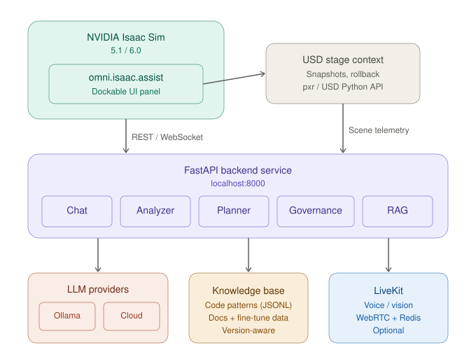
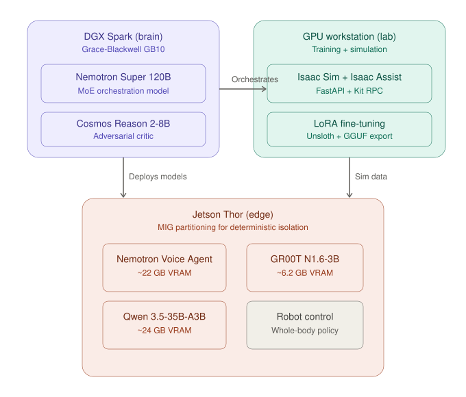
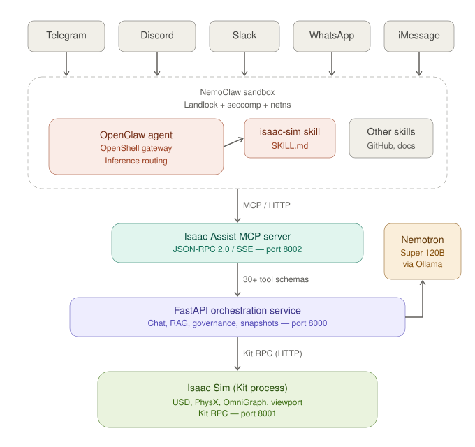
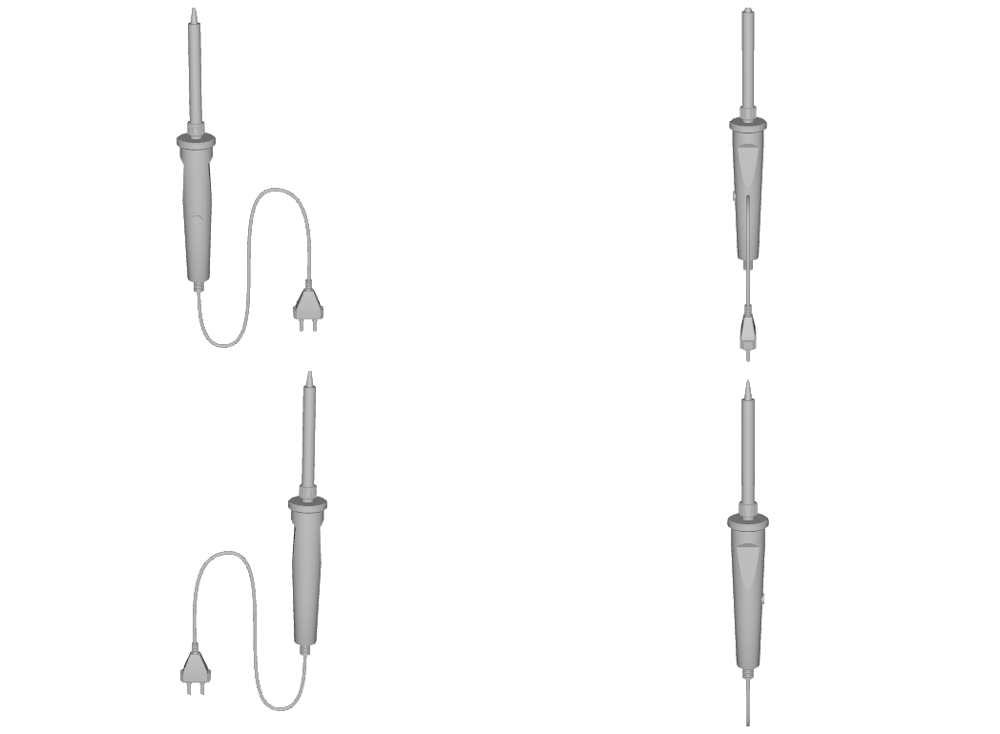
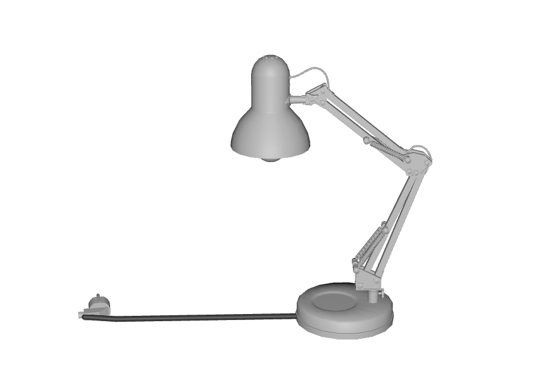
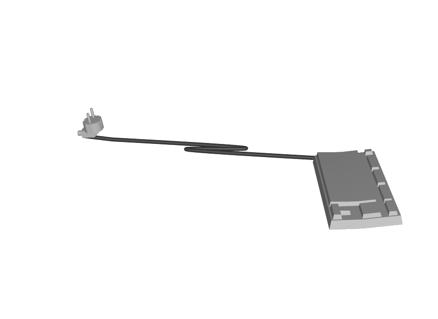
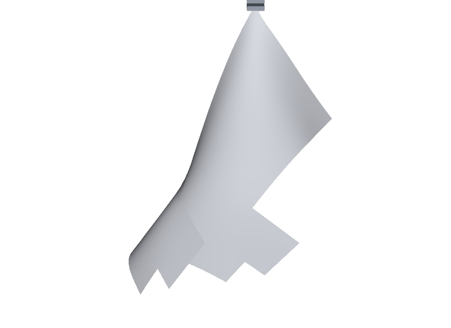
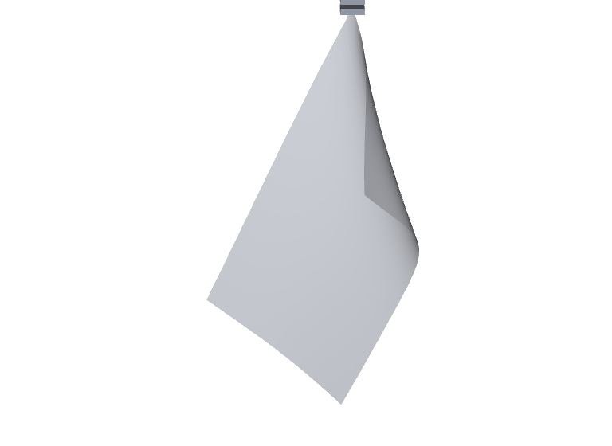
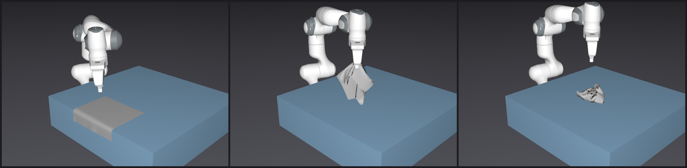
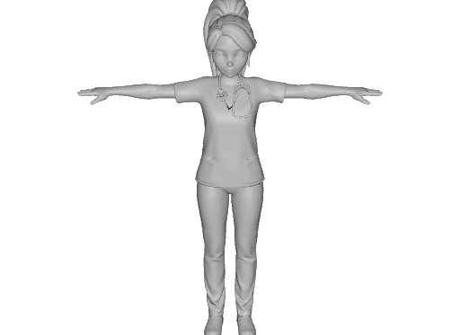

# Isaac Assist — Omniverse Extension & Background Service

> An agentic AI assistant for NVIDIA Isaac Sim that provides LLM-powered scene diagnostics, patch planning, and governance — surfaced through a dockable Omniverse UI panel backed by a local FastAPI service.

---

## Architecture







---

## Table of Contents

1. [Prerequisites](#1-prerequisites)
2. [Repository Layout](#2-repository-layout)
3. [Background Service Setup](#3-background-service-setup)
4. [LiveKit Voice Infrastructure (Optional)](#4-livekit-voice-infrastructure-optional)
5. [Running the Omniverse Extension](#5-running-the-omniverse-extension)
6. [Verify Everything Is Connected](#6-verify-everything-is-connected)
7. [GUI Smoke Test](#7-gui-smoke-test)
8. [Configuration Reference](#8-configuration-reference)
9. [Feature Modules](#9-feature-modules)
10. [Sim-Ready Asset Pipeline](#10-sim-ready-asset-pipeline)
11. [Contributing Data & Helping Train the Model](#11-contributing-data--helping-train-the-model)

---

## 1. Prerequisites

| Requirement | Version |
|---|---|
| NVIDIA Isaac Sim | 6.0 from source on DGX Spark; 5.1 still supported as a fallback |
| Python (system host) | 3.10+ |
| Docker + Docker Compose | Latest |
| Ollama *(local LLM mode)* | Latest |
| Git | Any |

> **GPU Note:** Isaac Sim requires an NVIDIA RTX GPU. Ensure your drivers and CUDA toolkit are up to date before proceeding.

---

## 2. Repository Layout

```
Omniverse_Nemotron_Ext/
├── exts/
│   ├── isaac_5.1/          # Omniverse Extension (Isaac Sim 5.1)
│   └── isaac_6.0/          # Omniverse Extension (Isaac Sim 6.0)
├── service/
│   └── isaac_assist_service/   # FastAPI backend service
│       ├── main.py             # App entry point
│       ├── .env.example        # Configuration template
│       └── ...                 # Feature modules (chat, analysis, planner, etc.)
├── web/
│   └── floor-plan-ui/      # React + Konva multimodal canvas GUI
├── infra/
│   └── livekit/            # Self-hosted LiveKit voice stack (Docker Compose)
├── scripts/                # Utility scripts (doc scraping, data curation)
├── launch_isaac.sh         # Recommended Isaac Sim launcher
├── launch_service.sh       # FastAPI service launcher (interactive mode picker)
└── requirements.txt        # Python backend dependencies
```

---

## 3. Background Service Setup

The FastAPI service must be running **before** you launch Isaac Sim. The extension UI communicates with it over `localhost:8000`.

### 3.1 Install dependencies

```bash
cd /path/to/Omniverse_Nemotron_Ext
pip install -r requirements.txt
```

### 3.2 Configure the environment

```bash
cp service/isaac_assist_service/.env.example service/isaac_assist_service/.env
# Open .env and set your preferred LLM mode and API keys
```

#### Key settings in `.env`

| Variable | Default | Description |
|---|---|---|
| `LLM_MODE` | `local` | `local` (Ollama), `anthropic` (Claude), `cloud` (Gemini), `openai`, or `grok` (xAI) |
| `LOCAL_MODEL_NAME` | `qwen3.6:latest` | Model name as shown in `ollama list` |
| `CLOUD_MODEL_NAME` | `claude-opus-4-6` | Cloud model identifier (used by all non-local modes) |
| `ANTHROPIC_API_KEY` | *(empty)* | Required when `LLM_MODE=anthropic` |
| `API_KEY_GEMINI` | *(empty)* | Required when `LLM_MODE=cloud` |
| `OPENAI_API_KEY` | *(empty)* | Required when `LLM_MODE=openai` |
| `GROK_API_KEY` | *(empty)* | Required when `LLM_MODE=grok` |
| `ROSBRIDGE_HOST` | `127.0.0.1` | rosbridge WebSocket host (for live ROS2 tools) |
| `ROSBRIDGE_PORT` | `9090` | rosbridge WebSocket port |
| `LIVEKIT_URL` | `ws://localhost:7880` | LiveKit server URL |

#### Pull the local model (if using `LLM_MODE=local`)

```bash
ollama pull qwen3.6:latest
```

Known-good local Ollama models on the development machine include:

| Model | Use |
|---|---|
| `qwen3.6:latest` | Default local Isaac Assist chat model |
| `nemotron3:33b` | NVIDIA-flavored local coding/reasoning fallback |
| `deepseek-r1:32b` | Deliberate reasoning / audit fallback |

### 3.3 Start the service

```bash
cd /path/to/Omniverse_Nemotron_Ext

# Interactive mode picker (recommended)
./launch_service.sh

# Or pass the LLM mode directly
./launch_service.sh anthropic   # Claude
./launch_service.sh local       # Ollama (local GPU)
./launch_service.sh google      # Gemini
./launch_service.sh openai      # OpenAI
./launch_service.sh grok        # xAI Grok
```

The service starts at **`http://localhost:8000`**.  
Interactive API docs are available at **`http://localhost:8000/docs`**.

The launcher prefers a project `.venv`, then a complete system Python, and
finally Isaac Sim's bundled `python.sh`. Override discovery with
`SERVICE_PYTHON=/path/to/python`; override the loopback bind with
`ISAAC_ASSIST_HOST` or `ISAAC_ASSIST_PORT` when needed. Container startup
continues to bind `0.0.0.0` explicitly. Development hot reload is opt-in with
`ISAAC_ASSIST_RELOAD=1` so the Isaac Python fallback does not spawn a divergent
child interpreter by default.

#### NVIDIA Video to Data

An optional adapter exposes NVIDIA's video-ingestion, depth-reconstruction,
clip-retrieval, and robotic-grounding pipelines as dry-run-first tools. V2D is
installed separately so its GPU/container dependencies do not enter the
sidecar environment. See [the V2D integration guide](docs/integrations/video-to-data.md).

An isolated, dry-run-first adapter also exposes NVIDIA Isaac GR00T N1.7
status, inference, policy serving, and fine-tuning commands. See the
[GR00T N1.7 integration guide](docs/integrations/groot-n17.md).
Use `./launch_groot_robolab.sh replay` for the bundled Isaac Sim visualization,
or `./launch_groot_robolab.sh live` to connect RoboLab to a GR00T policy server.
Franka torque/contact collection and masked sensor-aware datasets are documented
in [the force/contact data guide](docs/integrations/franka-force-tactile-data.md).

#### Containerized service

The container packages the core HTTP service. Live ROS2, Kit, and voice
integrations still require their host-side services and explicit networking.

```bash
docker build -t isaac-assist:local .
docker run --rm -p 8000:8000 --env-file .env isaac-assist:local
curl http://localhost:8000/health
```

#### Hot-switch LLM mode at runtime (no restart needed)

```bash
curl -X PUT http://localhost:8000/api/v1/settings/llm_mode \
  -H "Content-Type: application/json" -d '{"mode": "local"}'
```

---

## 4. LiveKit Voice Infrastructure (Optional)

Skip this section if you do not need voice/audio features.

```bash
cd infra/livekit
docker compose up -d
```

This starts:
- **LiveKit server** on ports `7880` (WebSocket), `7881` (HTTP), `7882/udp` (WebRTC)
- **Redis** on port `6379` (required by LiveKit)

To stop:

```bash
docker compose down
```

---

## 5. Running the Omniverse Extension

### 5.1 Using the launch script (recommended)

The `launch_isaac.sh` script configures the correct ROS2 environment and registers the extension folder automatically. It selects the matching extension harness for the detected Isaac Sim runtime:

| Runtime | Extension path | Notes |
|---|---|---|
| Isaac Sim 5.1 | `exts/isaac_5.1` | Legacy-compatible harness; `KIT_RPC_PORT` can override the default `8001` when co-running with another Kit instance. |
| Isaac Sim 6.0 | `exts/isaac_6.0` | Current active harness for Isaac Sim 6.0 / Isaac Lab 3 workflows. |

```bash
# Launch Isaac Sim with an empty scene
./launch_isaac.sh

# Launch Isaac Sim and open a specific USD file
./launch_isaac.sh /path/to/scene.usd

# Launch Isaac Sim 6.0 with Isaac Assist via the desktop-friendly wrapper
./launch_isaac_assist_desktop.sh

# Launch one canvas/generated scene with Isaac Assist loaded
./launch_canvas_scene.sh /path/to/scene.usd
```

To point at a custom Isaac Sim installation, set `ISAAC_SIM_PATH` or `ISAACSIM_PATH` in your `.env` file or export it before launching:

```bash
export ISAACSIM_PATH=~/Documents/Github/isaacsim/_build/linux-aarch64/release
./launch_isaac.sh
```

The script auto-detects architecture (`x86_64` or `aarch64`) and sets default paths accordingly. For DGX Spark/aarch64, the preferred path is the Isaac Sim 6.0 source-build release directory:

| Architecture | Default Path |
|---|---|
| x86_64 | `~/IsaacSim/_build/linux-x86_64/release`, `~/Documents/Github/isaacsim/_build/linux-x86_64/release`, then standalone 6.0/5.1 fallbacks |
| aarch64 (DGX Spark) | `~/IsaacSim/_build/linux-aarch64/release`, then `~/Documents/Github/isaacsim/_build/linux-aarch64/release` |

To rebuild Isaac Sim 6.0 from source on DGX Spark:

```bash
cd ~/Documents/Github/isaacsim
git fetch origin
git merge --ff-only origin/main
git lfs pull
./build.sh -r -u
export ISAACSIM_PATH=$PWD/_build/linux-aarch64/release
```

### 5.2 Manual extension loading (Isaac Sim Extension Manager)

If you prefer to load the extension manually inside Isaac Sim:

1. Open Isaac Sim.
2. Go to **Window → Extensions**.
3. Click the **⚙ gear icon** → **Add Extension Search Path**.
4. Add the path to the appropriate `exts/` folder:
   - Isaac Sim 5.1: `<repo_root>/exts/isaac_5.1`
   - Isaac Sim 6.0: `<repo_root>/exts/isaac_6.0`
5. Search for **`omni.isaac.assist`** and toggle it **ON**.

---

## 6. Verify Everything Is Connected

### Health-check the backend service

```bash
curl http://localhost:8000/health
# Expected: {"status":"ok","service":"isaac-assist-backend","llm_mode":"anthropic","model":"claude-opus-4-6"}
```

### Check the Extension UI

Once Isaac Sim is open and the extension is enabled, the **Isaac Assist** panel should appear as a dockable window. If it does not:

- Confirm the service is running (`curl` above).
- Check the Isaac Sim console (**Window → Console**) for extension errors.
- Verify the extension search path is registered (Step 5.2).

---

## 7. GUI Smoke Test

Use this after large merges to verify the visible experience, not just the unit-test layer.

### Floor-plan canvas GUI

```bash
cd web/floor-plan-ui
npm install
npm run dev -- --host 127.0.0.1
```

Open `http://127.0.0.1:5173?session=default_session` and confirm these major surfaces render:

- Header: `Isaac Assist · Floor Plan` and `multimodal canvas v1.0`
- Left tool rail and object palette
- Konva canvas viewport with grid, objects, reach/agency overlays, and snap-guide support
- Properties / layers side panel
- Agent confirmation bar
- Bottom chat ribbon, image import button, viewport import button, and status bar with revision/session/save state

For automated checks, run:

```bash
cd web/floor-plan-ui
npm run build
npm test
```

### Isaac Sim extension GUI

1. Start the service with `./launch_service.sh local`.
2. Start Isaac Sim with `./launch_isaac_assist_desktop.sh`.
3. Verify the **Isaac Assist AI** window opens from the Isaac Sim menu/extension.
4. Use the model selector to choose a local model such as `qwen3.6:latest`.
5. Use **Modes -> Extract layout from scene** to capture the current viewport into a floor-plan proposal.
6. Ask for a simple scene change, then confirm the transcript shows tool activity rather than a plain text-only answer.

The Isaac Sim GUI test requires a live Kit process and GPU. If Kit is not running, keep the verification to the floor-plan GUI plus the backend/unit gates.

---

## 8. Configuration Reference

Configuration is loaded in priority order (later files override earlier ones):

```
.env                  ← repo root defaults (git-ignored)
service/…/.env        ← service-level overrides (git-ignored)
.env.local            ← YOUR personal overrides — highest priority (git-ignored)
```

**Quick start:** Copy the example file and fill in your values:

```bash
cp .env.local.example .env.local
# Edit .env.local with your API keys and asset paths
```

See [`.env.local.example`](.env.local.example) for the full annotated template.

#### Key settings

| Variable | Example | Description |
|---|---|---|
| `LLM_MODE` | `anthropic` | `anthropic`, `openai`, `ollama`, or `gemini` |
| `CLOUD_MODEL_NAME` | `claude-opus-4-6` | Model name for cloud providers |
| `ANTHROPIC_API_KEY` | `sk-ant-xxx` | API key for your chosen provider |
| `ASSETS_ROOT_PATH` | `/home/user/assets` | Path to Isaac Sim USD assets (local or Nucleus) |
| `ISAAC_ASSIST_ASSET_ROOTS` | `/home/user/Desktop/assets` | One or more local USD asset roots for floor-plan build previews; separate multiple roots with `:` on Linux |
| `ASSETS_ROBOTS_SUBDIR` | `Collected_Robots` | Subdirectory containing robot USD files |
| `LIVEKIT_URL` | `ws://localhost:7880` | LiveKit server (optional, for voice/vision) |
| `CONTRIBUTE_DATA` | `false` | Log approved patches for fine-tuning |

#### Cosmos 3 scene proposal flow

Cosmos 3 is treated as a world-model proposal layer, not as a direct Isaac Sim
mutator. A Cosmos Reasoner workflow can turn a photo, screenshot, render, or
prompt into structured scene observations, then submit them to:

```text
POST /api/v1/canvas/{session_id}/cosmos/observe
POST /api/v1/canvas/{session_id}/cosmos/observe_viewport
POST /api/v1/canvas/{session_id}/cosmos/propose
POST /api/v1/canvas/{session_id}/cosmos/generate
```

`cosmos/observe` calls a configured OpenAI-compatible Cosmos 3 Reasoner
endpoint. If `GEMINI_ROBOTICS_ER_FALLBACK=true` and `GEMINI_API_KEY` is set,
Gemini Robotics-ER can act as a cloud backup that returns the same
`CosmosSceneObservation` contract when the Cosmos endpoint is unavailable.
`cosmos/observe_viewport` first captures the active Isaac Sim viewport
through Kit RPC, then calls the same observation flow. `cosmos/propose` accepts
already-structured observations. The backend
converts the observation into a reviewable `LayoutSpec` proposal.
The floor-plan UI remains the correction/confirmation surface, and the final
build goes through `POST /api/v1/canvas/{session_id}/build`. Builds default to
`dry_run=true`, returning resolved assets and generated Kit code for review;
set `dry_run=false` only when ready to queue the patch into live Isaac Sim. See
[Cosmos 3 to Floor-Plan Flow](docs/architecture/cosmos3-floor-plan-flow.md).

`cosmos/generate` calls a configured Cosmos 3 Generator endpoint and writes
durable artifacts under `workspace/multimodal/cosmos3_generations/`. It covers
the Cosmos 3 Omni modes that are useful for Isaac Assist review and robot data:
`text_to_image`, `text_to_video`, `image_to_video`, `video_to_video`,
`*_with_sound`, `policy`, `inverse_dynamics`, and `forward_dynamics`. The
default generation settings are intentionally light for DGX Spark/Nano smoke
tests: `320x192`, `24` frames, `12` fps, and `35` denoising steps. Increase to
480p/720p and longer frame counts once endpoint latency and VRAM headroom look
good.

Floor-plan builds can also carry semantic spatial relations such as
`on_top_of`, `inside`, `contains`, and `supports`. The instantiator normalizes
those relations into approximate 3D placement, using support surfaces and
container/interior affordance hints to compute Z offsets. This is the first
step toward rebuilding scenes like "fruit in a bowl on a table" or "a plate in
a microwave on a counter" from a 2D review surface plus vision/Cosmos relation
proposals.

#### Scenario variant campaigns

`LayoutSpec` also carries a `scenario_variants` contract for controlled
multi-scene generation. The floor-plan UI exposes this in the **Scenario
Variants** panel:

- `variant_count` and `seed` control campaign size and repeatability.
- Lighting presets cover studio, warehouse, dome, backlit, and low-angle setups.
- Camera presets cover overhead, robot-view, side-view, and wide-context views.
- Optional actors/circumstances add humans, mobile robots, occlusion,
  distractors, moved targets, and tight-clearance cases.
- Perturbations control pose jitter, rotation jitter, material randomization,
  and sensor noise.
- Validation flags request relation, visibility, and physics checks before
  accepting a generated variant.

Today this is a declarative contract surfaced in **Preview Build** and saved
with the canvas spec. The next execution layer can consume the same contract
locally, through Isaac Automator, or on Brev/DGX to fan out one reviewed
floor-plan into many tested Isaac/Cosmos scenes.

The backend can already expand the saved contract into a deterministic campaign
plan:

```text
POST /api/v1/canvas/{session_id}/campaign/plan
POST /api/v1/canvas/{session_id}/campaign/materialize
```

The response includes a `campaign_id`, per-variant seeds, lighting/camera/actor
and circumstance selections, validation requirements, planned USD paths, and a
`launch_command` for each variant. The floor-plan UI's **Plan campaign** button
flushes pending edits, calls this route, and shows the first launch command.
The **Materialize campaign** button writes the campaign manifest, the saved
`LayoutSpec`, one minimal `.usda` stage per variant, and one Isaac Sim setup
script per variant under `workspace/scenario_campaigns/<campaign_id>/`.

To automatically open one generated or saved USD scene with the extension
already loaded, use:

```bash
./launch_canvas_scene.sh /path/to/scene.usd
```

For a materialized variant, use the launch command emitted in the campaign
manifest. It includes the setup script that applies the generated Kit scene
patch after the minimal stage opens:

```bash
SCENE_SETUP_SCRIPT=workspace/scenario_campaigns/<campaign>/<variant>_setup.py \
  ./launch_canvas_scene.sh workspace/scenario_campaigns/<campaign>/<variant>.usda
```

Or use the local runner, which selects a variant from `campaign_plan.json`,
writes `<variant>_result.json`, tails launcher output into
`<variant>_launch.log`, and starts Isaac Sim with the correct setup script:

```bash
./scripts/run_materialized_variant.sh workspace/scenario_campaigns/<campaign>/campaign_plan.json --index 1

# No Isaac launch; write/inspect the result artifact only
./scripts/run_materialized_variant.sh workspace/scenario_campaigns/<campaign>/campaign_plan.json --index 1 --dry-run
```

This wrapper starts the backend if needed through
`launch_isaac_assist_desktop.sh`, selects Isaac Sim 6.0 by default, registers
`exts/isaac_6.0`, enables `omni.isaac.assist`, and opens the USD through the
startup hook in `launch_isaac.sh`.

Cosmos 3 Reasoner belongs before this materialization step. Use
`/cosmos/observe`, `/cosmos/observe_viewport`, or `/cosmos/propose` to infer
objects, asset hints, and spatial relations from prompts, photos, renders, or
the live Isaac viewport. The floor-plan UI remains the review surface; once the
relations and asset choices are accepted, the campaign planner/materializer
turns that reviewed spec into deterministic variant jobs.

For scale-out, Isaac Assist treats DGX Spark, Brev, and
[isaac-sim/IsaacAutomator](https://github.com/isaac-sim/IsaacAutomator) as
remote capacity providers. See
[Remote Scale Providers](docs/architecture/remote-scale-providers.md) for the
planned extension/backend contract.

For Cosmos 3 Reasoner NIM, prefer a same-LAN DGX Spark when one is available.
That keeps the local Isaac Sim GPU free for rendering and live stage mutation.
The helper below starts the NIM endpoint on Spark or another GPU host:

```bash
export NGC_API_KEY=nvapi-...
COSMOS_NIM_CACHE=$HOME/nim-cache/cosmos3-reasoner \
  COSMOS_NIM_PORT=8081 \
  NIM_MAX_MODEL_LEN=32768 \
  ./scripts/start_cosmos3_reasoner_nim.sh
```

Then point Isaac Assist at the remote endpoint:

```bash
COSMOS3_REASONER_BASE_URL=http://<spark-host-or-ip>:8081/v1
COSMOS3_REASONER_MODEL=nvidia/cosmos3-nano-reasoner
```

For Cosmos 3 Generator video/image/action output, run vLLM-Omni on the host
with the Nano weights and point Isaac Assist at that endpoint:

```bash
COSMOS_GENERATOR_PORT=8082 \
COSMOS_GENERATOR_MODEL=nvidia/Cosmos3-Nano \
  ./scripts/start_cosmos3_generator_vllm_omni.sh

COSMOS3_GENERATOR_BASE_URL=http://<spark-host-or-ip>:8082/v1
COSMOS3_GENERATOR_MODEL=nvidia/Cosmos3-Nano
```

Smoke-test text-to-video through Isaac Assist:

```bash
curl -sS -X POST http://127.0.0.1:8000/api/v1/canvas/demo/cosmos/generate \
  -H 'Content-Type: application/json' \
  -d '{
    "mode": "text_to_video",
    "prompt": "a gripper grabs a red cube and slowly lifts it",
    "size": "320x192",
    "num_frames": 24,
    "fps": 12
  }'
```

#### Asset path examples

```bash
# Local filesystem (recommended — works offline)
ASSETS_ROOT_PATH=/home/user/Desktop/assets
ISAAC_ASSIST_ASSET_ROOTS=/home/user/Desktop/assets

# NVIDIA Omniverse Nucleus server
ASSETS_ROOT_PATH=omniverse://localhost/NVIDIA/Assets/Isaac/5.1

# NVIDIA S3 hosted (requires network access)
ASSETS_ROOT_PATH=https://omniverse-content-production.s3-us-west-2.amazonaws.com/Assets/Isaac/5.1
```

#### Gather local assets for floor-plan builds

The floor-plan canvas becomes much more useful when the backend can resolve
reviewed classes to real USD assets instead of primitive placeholder geometry.
For local/offline work, gather Isaac Sim, SimReady, Warehouse, robot, and
customer USD assets under a common folder such as:

```text
/home/<user>/Desktop/assets/
```

Set `ISAAC_ASSIST_ASSET_ROOTS` to that folder before launching the service. The
asset resolver checks explicit user overrides first, then palette references,
then known local asset paths, and finally any `asset_catalog.json` files found
under the configured roots. This is what lets **Preview Build** turn floor-plan
objects such as `conveyor_short`, `bin`, and `cube` into real USD references.

Good asset packs to collect include:

- NVIDIA Isaac Sim robot and sample assets for robot references and baseline props.
- SimReady Containers / Shipping assets for bins, crates, boxes, pallets, and workpieces.
- Warehouse / Digital Twin assets for conveyors, racks, facility equipment, and layout props.
- Project-specific customer assets that should appear in recreated scenes.

Keep `asset_catalog.json` files next to downloaded asset packs when available.
They improve fallback matching when a class does not have a hard-coded local
override yet.

---

## 9. Feature Modules

The FastAPI service exposes the following REST API modules, all prefixed under `/api/v1/`:

| Endpoint Prefix | Module | Description |
|---|---|---|
| `/chat` | Chat Orchestration | Multi-turn LLM conversations with the stage context |
| `/fingerprint` | Environment Fingerprint | Hardware, Omniverse version & active extension telemetry |
| `/snapshots` | Snapshot Manager | USD stage serialization and rollback |
| `/retrieval` | Source Registry RAG | Omniverse doc scraping + vector retrieval |
| `/analysis` | Stage Analyzer | Scene constraint checks and validator packs |
| `/plans` | Patch Planner | Repair plan generation and execution engine |
| `/governance` | Approval Engine | Dry-run UI dialogs for user-governed USD edits |
| `/settings` | Configuration Options | Model switching, Ollama pull triggers, API keys |
| `/settings/llm_mode` | LLM Mode Switch | `GET` current mode, `PUT` to hot-switch provider |
| `/chat/pipeline/plan` | Pipeline Planner | Template-based multi-phase autonomous scene builder |
| `/finetune` | Fine-tuning Builder | Knowledge Base → training data pipeline |
| `/canvas/{session_id}/cosmos/propose` | Cosmos 3 Adapter | Cosmos Reasoner scene observations → floor-plan `LayoutSpec` proposals |
| `/canvas/{session_id}/cosmos/observe` | Cosmos 3 Runtime | Image/prompt → Cosmos observation → floor-plan `LayoutSpec` proposal |
| `/canvas/{session_id}/cosmos/observe_viewport` | Cosmos 3 Runtime | Active Isaac viewport screenshot → floor-plan `LayoutSpec` proposal |

Full interactive documentation: **`http://localhost:8000/docs`**

### External Chat MCP Floor-Plan Tools

External MCP chat clients can use the floor-plan as the semantic window into
Isaac Sim instead of trying to infer the 3D stage directly. The MCP server
advertises these scene-creation tools:

| MCP Tool | Purpose |
|---|---|
| `create_floor_plan_from_text` | Convert a text scene description into a reviewable `LayoutSpec`. |
| `create_floor_plan_from_image` | Use the configured image/reasoner path to create a floor-plan proposal from an image. |
| `create_franka_physics_pick_scene` | Create a full-physics Franka tabletop pick scene with rigid workpieces, static supports, relation metadata, and a pick-place controller plan. |
| `create_ros2_scene_harness` | Write a project-local ROS2 package plus scene contract, controller config, launch file, and active-stage preflight targets. |
| `preflight_isaac_stage_targets` | Read the active Isaac stage identity and confirm caller-specified target prims before graph or robot-control tools run. |
| `search_local_assets` | Search configured USD asset roots such as `/home/kimate/Desktop/assets`. |
| `set_object_asset` | Pin a selected USD asset to a floor-plan object via `metadata.reviewed_asset_ref`. |
| `build_scene_from_floor_plan` | Dry-run or build the current floor-plan into Isaac/Kit generated code. |
| `launch_scene_in_isaac` | Materialize and launch one generated scene variant. Defaults to dry-run. |
| `verify_scene_relations` | Normalize and validate support/containment relations before claiming success. |

Recommended external-client flow: create a floor-plan from text or image,
search and pin real assets where needed, verify relations, dry-run the scene
build, preflight the active Isaac stage and caller-specified target prims, then
launch only after the generated code and relation diagnostics look right.

For a manipulation smoke scene, use `create_franka_physics_pick_scene` with
`motion_backend="auto"` or `"curobo"`. That path creates the physics scene and
returns arguments for the existing `setup_pick_place_controller` live Isaac
tool. `create_ros2_scene_harness` records the expected live-stage prim paths in
`config/scene_contract.json` so agents can run `preflight_isaac_stage_targets`
before any live graph or robot-control action. `motion_backend="cumotion"`
records a MoveIt/cuMotion bridge contract and validated dry-run plan, while
live viewport pickup still routes through the existing pick-place controller
until the opus-runtime cuMotion execution bridge is connected.

### Recent merged capabilities

The current `master` includes the PR 115-117 integration wave:

- Canonical backlog and template expansion for industrial, ROS2, GR00T, Isaac Lab, safety, SDG, and manipulation workflows.
- Role-based canonical template repairs and sandbox-safety validation for capture-time failures.
- Extended canonical linting, including enum/nested validation and `--validate-sandbox`.
- Coexistence protection for Isaac Sim 5.1 and 6.0 extension harnesses.
- Floor-plan GUI build/test baseline pinned to Vite/Vitest versions that work on Node 18.
- Cosmos 3 proposal adapter for photo/screenshot/prompt-to-floor-plan scene reconstruction.
- Sim-ready asset pipeline: autonomous visual approval, corded electronics,
  deformables and cloth actuation, rigged characters — see
  [Section 10](#10-sim-ready-asset-pipeline).

---

## 10. Sim-Ready Asset Pipeline

A downloaded USDZ is not a simulation asset. It has no mass, no collision, no
material, and often the wrong scale and up-axis. This pipeline takes raw
downloads to physics-verified, machine-approved assets — and it judges its own
work before a human ever sees it.

```
ingest  ->  classify  ->  make sim-ready  ->  render  ->  vision judges
              |                                              |
        class priors                                    rubric + verdict
        (50 classes)                                          |
                                            live PhysX drop + headless Newton
                                                              |
                                                    registry (66 assets)
```

Current state: **2377 assets ingested**, 2326 with a recorded visual-QA verdict,
**62 machine-approved**, 66 promoted to the sim-ready registry, **32 of those
independently re-verified in a second physics engine**.

### 10.1 Autonomous visual approval

Every asset is rendered as four orbit views, because integrity cannot be judged
from a single frame — a missing back face, a hollow interior, or an untextured
patch hides from a front view.



Those views go to an ensemble of vision judges — **Cosmos-Reason2** (local
vLLM), **Gemma** (local Ollama), and **Claude** with structured outputs — which
are scored by a rubric rather than trusted directly:

| Check | What it rejects |
|---|---|
| `judges_healthy` | A verdict from an ensemble that partly failed to answer. |
| `identity_agreement` | Judges that disagree about what the object even is. |
| `integrity` | Holes, missing faces, hollow shells, broken geometry. |
| `scale_in_prior` | A 4 m coffee mug. Bounds must land in the class prior. |
| `physics_ready` | Mass outside the class prior, or an implied density outside 15-3000 kg/m3. |
| `no_error_callouts` | Any judge naming a concrete defect. |
| `prior_confirmed` | A class the priors do not actually support. |
| `rigid_scope` | A rigid sign-off on something that is not rigid. |

The rubric is deliberately harsh, and it is applied to the machine's own
earlier decisions: an implied-density guard caused it to **revoke three of its
own approvals** after class-midpoint masses produced a 1.26 kg computer mouse.

```bash
python scripts/visual_qa.py <asset_id> [...]        # judge specific assets
python scripts/visual_qa.py --all-pending --approve  # judge + sign off the queue
```

**Deformables never take this path.** Cloth, foam and gel sign-off stays human;
the machine only records evidence.

### 10.2 The critic runs before the human

The judges are also pointed at our *own* renders before anything is presented
for review — the same models, asked what is wrong with the picture rather than
what is in it. This exists because output was repeatedly shown to a human while
visibly broken.

```bash
python scripts/critique_render.py <render.png> [...] --expect "a desk lamp with a cord"
```

It is also exposed as the `critique_render` chat tool.

### 10.3 Corded electronics

Cords are where asset physics and articulation meet. A cord is authored either
as a **routed static cord** — a Bezier path from the device's cord exit to the
plug, with a single-sided slack bow, clamped to the surface only in its
interior so the endpoints stay attached — or as a **dynamic capsule chain**
with D6 joints.





Cord-exit direction is knowledge, not geometry: it lives in the class priors per
device type. Where a human corrects an attachment in the viewport,
`capture_attachment.py` converts that correction into the asset's own space and
stores it permanently, so it is made once and reused forever. (The store is
created on first capture; until then `make_cable.py` falls back to its
geometric fat-end heuristic. Capture *before* reloading the layer — a forced
reload discards viewport edits.)

```bash
# a bare cord
python scripts/make_cable.py cable --length 1.2 --radius 0.004 --out cord.usda
# a device composed with its cord and plug
python scripts/make_cable.py compose --iron <iron.usd> --plug <plug.usd> \
    --length 1.5 --out lamp_corded.usda
# store a human's viewport correction permanently, in the asset's own space
python scripts/capture_attachment.py --asset power_plug_european \
    --prim /World/Kettle/Plug --cord /World/Kettle/Cord
```

Routed assemblies are **fully static** — an earlier version returned before the
joint code ran, leaving the plug a free rigid body that flew off on play.

### 10.4 Cloth actuation

The laundry-fold grasp: two kinematic finger boxes pinch a garment corner with
friction alone (no attachment constraint) and lift it 35 cm.





Both images are the **actual solver state** exported to USD and rendered — not
mock-ups. The Newton 0.2 baseline passed 5/5 generated garments on CUDA in 90
s: 4 mm slip, the corner rose the full 35 cm, and the garment hung 117-146 cm
and settled to under 0.7 cm of residual swing. Revalidated on 2026-08-14 with
Newton 1.5.0 + Warp 1.16.0, the particle-contact path again passes **5/5**;
measured slip is now 13-37 mm. Versioned evidence records the new results
without silently replacing the old baseline.

```bash
python3 -m venv .venv-newton
.venv-newton/bin/pip install -r requirements-newton.txt

.venv-newton/bin/python scripts/verify_asset_newton.py \
    cloth_grasp garment_towel
CLOTH_EXPORT_USD=out.usda ... cloth_grasp garment_tshirt   # export for render
# Newton 1.5 edge/face contact A/B (particle contact remains the default)
NEWTON_FULL_SURFACE_CONTACT=1 .venv-newton/bin/python \
    scripts/verify_asset_newton.py cloth_grasp garment_towel
```

Three things about this are easy to get wrong and fail *silently*:

- `SolverVBD` ignores rigid shapes entirely unless constructed with
  `integrate_with_external_rigid_solver=True`. Without it the cloth passes
  through the fingers and falls 25 m, with no error.
- `wp.array.numpy()` is a **view on CPU but a copy on CUDA**. Pose-driving a
  gripper by mutating it works on CPU and silently does nothing on GPU.
- "Did the centroid rise?" is not a grasp test — it fails a *perfect* grasp,
  because a flat sheet lifted by one corner necessarily loses centroid height
  as it becomes a hanging sheet.

### 10.5 A robot picks the cloth up

Cloth actuation with abstract finger boxes is a physics result; a robot doing
it is a task. A Franka FR3 takes a washcloth off a table, carries it, and puts
it down.



*Approach (the flap overhangs the table edge) → carried clear of the surface →
set down 30 cm away. Rendered from the recorded simulation, not staged.*

```bash
.venv-newton/bin/python scripts/pick_place_cloth.py garment_washcloth
PICK_PLACE_RECORD_USD=scene.usd ... scripts/pick_place_cloth.py garment_napkin
```

The Newton 0.2 baseline measured 5 consecutive runs on the **washcloth (18 g):
5/5 carried it 0.20–0.26 m of a commanded 0.30 m**, intact, resting on the
table, settled. It falls short of the full 0.30 m because the grasp takes a
flap rather than the whole garment, so the cloth partly drags — which is what
real fabric does.

The Newton 1.5 probe runs end to end and carries the washcloth 0.23 m, but it
does **not** pass the final gate: after opening, particle contact leaves the
cloth caught on the retreating hand instead of resting on the table. Full
finger travel and a lateral-withdrawal experiment did not fix that behavior,
so this is recorded as a release/contact regression rather than hidden by a
weaker landing threshold.

**It does not yet work on the napkin, and that is a real limit rather than a
tuning detail.** The napkin is 0.45 m square and 41 g — 2.3× the washcloth's
mass on the same single-flap pinch — and it consistently slips: three runs
carried it 0.11 m, 0.09 m and 0.09 m of the commanded 0.30 m. A friction grasp
holds only what its contact patch and normal force can hold, so a one-flap
pinch is mass-limited. Carrying heavier garments needs a bigger bite, a second
grasp point, or both hands — which is also what a folding task needs, so it is
the next piece of work rather than a workaround.

**Why a standalone Newton path remains useful.** NVIDIA's reference uses a
Franka under `SolverFeatherstone` coupled one-way to cloth under `SolverVBD`
(`newton.examples cloth_franka`), roughly 300× faster than GPU-IPC. Isaac Lab
3.0 Beta 2 now includes experimental VBD deformables and an
[`Isaac-Lift-Cloth-Franka-v0`](https://isaac-sim.github.io/IsaacLab/release/3.0.0-beta2/source/overview/core-concepts/physical-backends/newton/newton-manager-abstraction.html)
task, so issue #5285 is no longer the right blocker. That release is still on
Newton 1.2.1, while these probes pin Newton 1.5.0 and Warp 1.16.0 in a separate
environment. We should port the task to Isaac Lab after its Newton dependency
catches up; until then, forcing 1.5 into Isaac's environment would invalidate
its tested dependency set. The local coupling remains deliberately one-way: a
30 g washcloth does not materially perturb a Franka.

[Newton 1.5](https://github.com/newton-physics/newton/releases/tag/v1.5.0)
also adds opt-in full-surface VBD contacts. Set
`NEWTON_FULL_SURFACE_CONTACT=1` only to reproduce the A/B test: in the current
washcloth gate it ejects the cloth by tens of metres and fails. Particle
contact therefore remains the supported default. Cable thresholds were
revalidated after preserving 1.5's changed shear/twist slots: load/slack and
friction-grasp gates both pass.

Psyonic hands can use Newton 1.5 hydroelastic contact without changing the
canonical robot or Isaac Lab's pinned runtime. The generator references the
canonical USD, selects its generic `Physics=physics` variant, disables the 68
overlapping hand colliders only in the wrapper, and authors one closed SDF
collider for each of the 22 hand rigid bodies:

```bash
WARP_CACHE_PATH=/tmp/newton-warp-cache \
  .venv-newton/bin/python scripts/make_newton_hydro_hands.py \
  /path/to/amber_revan_psyonic_lsmall_rsmall.usda \
  /path/to/amber_revan_psyonic_lsmall_rsmall_newton_hydro.usda

# CUDA-only: build every mesh SDF and test one fingertip contact pair
WARP_CACHE_PATH=/tmp/newton-warp-cache \
  .venv-newton/bin/python scripts/smoke_newton_hydro_hands.py \
  /path/to/amber_revan_psyonic_lsmall_rsmall_newton_hydro.usda \
  --write-manifest
```

The generated companion preserves 52 bodies and 52 joints. On the GB10, all
22 SDFs build and the isolated left-index distal collider produces 64 reduced
hydroelastic contacts against a temporary sphere at 2 mm penetration. Objects
the robot grasps must also opt into SDF hydroelastic collision; this is rigid
distributed-pressure contact, not deformable fingertip tissue.

The robot/Newton workflow is also exposed as the project-owned Agent Skill
`.agents/skills/newton-hydroelastic-hands`. NVIDIA's official CAD-to-SimReady,
USD performance-tuning, and realtime-viewer skills can be used alongside it.
The CPU-only `nvidia_usd_validation` Stage Analyzer pack and the disabled-by-
default Kit/USD/Isaac MCP endpoint template are documented in
[`Docs/13_NVIDIA_OMNIVERSE_AGENTS.md`](Docs/13_NVIDIA_OMNIVERSE_AGENTS.md).

**The finding that shaped the whole task:** *a parallel-jaw gripper cannot pick
a flat sheet off a table.* The fingers close beside zero-thickness fabric
pressed against the surface. Dropping the garment first does not fix it either
— a plain square sheet lands flat again (measured: 8 mm of loft, its own
thickness). The reference example gets away with it only because a shirt has
sleeves and a collar holding fabric off the table. So the task is staged the
way it is really staged: part of the garment over the table edge, where the
flap hangs in free air with something for each finger to close against. The
grasp point is then chosen from the *settled* geometry, the way a perception
stack would, rather than assumed up front.

### 10.6 Cloth as a pick-and-place workpiece (live path)

The Franka pick scene is **workpiece-agnostic**. It used to hardcode 5 cm
rigid cubes, which quietly decided two things it had no business deciding: that
the workpiece has a rigid body, and how big it is.

```
create_franka_physics_pick_scene(session_id=..., workpiece="towel")
```

`workpiece` takes any pickable palette class — `cube_small`, `cylinder_medium`,
`sphere`, `bolt`, `washcloth`, `napkin`, `hand_towel`, `towel`, `tshirt`.
Anything that is not pickable is rejected by name rather than silently
mishandled (`'franka_panda' is not a pickable workpiece (it is a robot)`).

| Where | Change |
|---|---|
| `multimodal/object_palette.py` | 5 deformable workpiece classes: `washcloth`, `napkin`, `hand_towel`, `towel`, `tshirt`. |
| `multimodal/instantiator.py` | `_DEFORMABLE_WORKPIECE_CLASSES` beside the rigid set; emits `_apply_cloth` (`PhysxDeformableSurfaceAPI` + material preset) instead of `RigidBodyAPI`. |
| `mcp_floorplan_tools.py` | `_workpiece_profile()` derives physics, footprint and spacing from the palette; `require_rigid_body_api_for_workpieces` is now conditional; `grip_style` is chosen from what is being picked. |
| `chat/tools/handlers/pick_place.py` | `_is_deformable()` routes cloth to a **friction grasp**. |

Everything downstream follows from the class:

| | `cube_small` | `towel` |
|---|---|---|
| workpiece physics | `dynamic_rigid_body` | `deformable_surface` |
| rigid-body API required | yes | **no** |
| grip style | `fixed_joint` | **`friction`** |
| of 3 requested, placed | 3 | 1 (2 reported dropped) |

That last row matters: spacing comes from the workpiece's own footprint, so a
large one spaces itself off the end of the table — three 1.4 m towels would be
placed at x = 0.38, 2.34 and 4.30 against a table that stops at 1.55, two of
them floating in mid-air. The count is fitted to the surface and the shortfall
is reported as `object_count_dropped` rather than silently truncated.

The grasp is still the real blocker. The rigid path holds an object by welding a
`UsdPhysics.FixedJoint` between the end effector and the workpiece. A
FixedJoint needs a rigid body at both ends and a deformable prim has none, so
on cloth it **defines cleanly and holds nothing** — the arm completes its whole
trajectory having picked up air. Cloth is therefore held the way a real gripper
holds fabric, and the way the Newton run above holds it: friction between fully
closed fingers and the cloth. A 4 mm gap that grips a cube lets a 0.4 mm sheet
slide straight out, so cloth closes to zero.

### 10.7 Physics verification

Two independent engines, because agreement between two is a far stronger
sim2real claim than either alone.

| Command | What it proves |
|---|---|
| `verify_asset_live.py` | Live PhysX drop test inside Isaac. |
| `verify_asset_newton.py rigid` | The same USD re-dropped in Newton. Current registry: Newton 0.2 passed 32/32; Newton 1.5 passes 30/32. |
| `... drape` / `fold` / `squish` | Deformable behaviour: cloth collapses, folds stay folded. |
| `... cable` | A cord pulls straight under load and holds its bow when slack. |
| `... grasp` / `cloth_grasp` | A gripper carries a cord, and a gripper carries a garment. |

Newton runs on CUDA by default (`NEWTON_DEVICE` overrides). VBD is a
GPU-parallel method — Newton disables its tiled solve entirely on CPU.
The two Newton 1.5 rigid failures are retained as versioned evidence:
`frying_pan` has not settled by 4 s, and `planter_round_02_inst_base` does not
make the expected 10 cm drop with its imported collision hull. The foam-brick
VBD compression gate also passes on 1.5 (0.10 restitution, 0.94 height ratio).

> **Known gap:** `drape` is vacuous for the *generated* garments. They are
> authored as flat sheets, so initial z-extent is zero and "collapses to flat"
> cannot fail. It remains meaningful for scanned deformables.

### 10.8 Rigged characters and crowds

Scenes need people. Rigged characters are detected via UsdSkel, bound to motion
clips, and spawned as walking crowds.



```bash
# Isaac must be running; clips: stand_walk_1..5,7 (+_mirror), Sit,
# LookAround, stand_idle_loop, stand_idle_wave_loop
python scripts/spawn_walking_person.py --clip stand_walk_1 --port 8001
python scripts/verify_character.py <asset_id> [...]   # skeleton, skin, motion
```

Scene blueprints accept a `characters` list, so chat requests like *"spawn a
scene with people walking and sitting on furniture"* resolve to clip-bound
characters on the live stage.

### 10.9 Chat tools

| Tool | Purpose |
|---|---|
| `ingest_asset_report` | Ingest and classify an asset or a whole folder. |
| `make_sim_ready` | Author mass, collision, material and scale onto a raw asset. |
| `create_corded_asset` | Compose a device with a physically routed cord. |
| `create_deformable_mesh` | Author cloth / sponge / rubber / gel deformables. |
| `critique_render` | Ask the vision judges what is wrong with a render. |

### 10.10 Knowledge files

| File | Contents |
|---|---|
| `workspace/knowledge/asset_class_priors.json` | 50 classes: size, mass, density, `deformable`, `cord_exit`. |
| `workspace/knowledge/cord_attachments.json` | Human-corrected attachment points, in asset space. Written by `capture_attachment.py` and preferred by `make_cable.py` over its geometric guess; created on first capture, so it is absent until a human corrects one. |
| `workspace/knowledge/product_specs.json` | Looked-up real product dimensions and masses. |
| `workspace/knowledge/sim_ready_assets.json` | The registry: 66 verified assets with evidence. |


---

## 11. Contributing Data & Helping Train the Model

Isaac Assist uses a **version-aware knowledge base** to ground the LLM in verified, working code patterns for each Isaac Sim release. Community contributions to this knowledge base directly improve the quality of generated code for everyone — and can ultimately feed into a fine-tuned model purpose-built for Isaac Sim development.

### 11.1 How the Knowledge Base Works

The knowledge base lives in `workspace/knowledge/` and consists of:

| File | Purpose |
|---|---|
| `code_patterns_5.1.0.jsonl` | Verified code snippets for Isaac Sim 5.1 |
| `code_patterns_6.0.0.jsonl` | Verified code snippets for Isaac Sim 6.0 / Isaac Lab 3 |
| `knowledge_5.1.0.jsonl` | Indexed documentation chunks |

When a user asks the LLM to perform an action, the system automatically retrieves relevant patterns for the active Isaac Sim version and injects them into the prompt. This means the LLM sees **working, tested code** rather than hallucinating outdated Kit commands.

### 11.2 Contributing Code Patterns

Code patterns are stored as JSONL (one JSON object per line). Each entry has this format:

```json
{
  "title": "Short descriptive title",
  "keywords": ["keyword1", "keyword2", "keyword3"],
  "code": "import omni.usd\nfrom pxr import UsdGeom\n\n# ... working code ...",
  "note": "Brief note about gotchas or why this approach is preferred."
}
```

**To contribute a pattern:**

1. Fork this repository
2. Open the appropriate `workspace/knowledge/code_patterns_<version>.jsonl`
3. Add your entry as a new line at the end of the file
4. Test the code in the matching Isaac Sim version to confirm it works
5. Submit a PR with:
   - The JSONL entry
   - Which Isaac Sim version you tested on
   - A brief description of what the pattern does

**Good pattern contributions:**
- Working code for Isaac Sim APIs that are poorly documented
- Patterns that replace broken or deprecated Kit commands with direct USD/pxr API calls
- Robotics workflows (URDF import, joint drives, articulations)
- Sensor setup (cameras, lidar, IMU)
- OmniGraph node creation for ROS2 bridges
- Physics tuning (solver iterations, collision groups, deformable parameters)

> **Important:** All contributed patterns should use **direct pxr/USD Python APIs** rather than `omni.kit.commands.execute(...)` — Kit commands are unreliable across Isaac Sim versions.

### 11.3 Contributing Documentation

If you have Isaac Sim documentation, tutorials, or workflow notes, you can contribute them to the RAG index:

1. Add `.md` or `.txt` files to `workspace/knowledge/`
2. The indexer will chunk and store them in the full-text search index
3. Submit a PR with your docs and the Isaac Sim version they apply to

### 11.4 Fine-Tuning Data Pipeline

Isaac Assist includes a built-in fine-tuning data pipeline. When the "Contribute Fine-Tuning Data" option is enabled in the extension settings, your chat interactions (prompts + approved code patches) are logged locally in `workspace/finetune_exports/`.

**How this feeds into model training:**

1. **Local collection** — Each approved code execution is recorded as an instruction/response pair
2. **Export** — Use the "Export Training Data" button in settings (or `POST /api/v1/finetune/export`) to generate training-ready JSONL
3. **Community aggregation** — Exported datasets can be contributed via PR to a shared training corpus
4. **Fine-tuning** — The `scripts/tuning/` directory contains tooling for LoRA fine-tuning with [Unsloth](https://github.com/unslothai/unsloth) and GGUF export for local deployment via Ollama

The long-term goal is a community-trained model that understands Isaac Sim's full API surface — every contributed pattern and training pair brings that closer.

### 11.5 Contribution Guidelines

- **One pattern per line** — keep the JSONL format strict (no trailing commas, valid JSON)
- **Test before submitting** — every code pattern must be verified in the stated Isaac Sim version
- **No API keys or secrets** — the secret redactor catches most, but double-check your contributions
- **Version-tag your PR** — indicate which Isaac Sim version(s) your contribution targets
- **Prefer minimal examples** — patterns should be self-contained and focused on one concept

---

> **Spec Reference:** See `Docs/00_INDEX.md` for the full ecosystem specification, data models, and phase roadmap.
